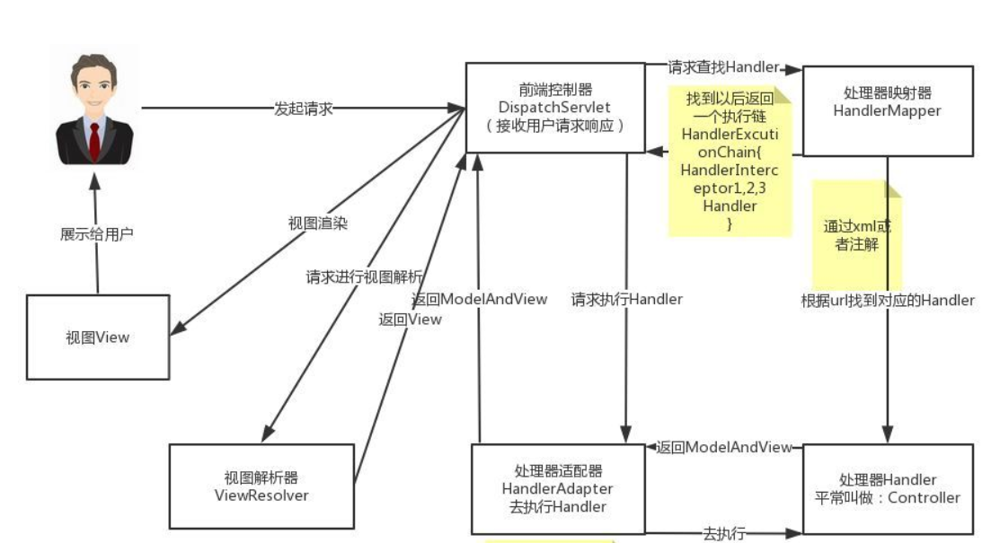
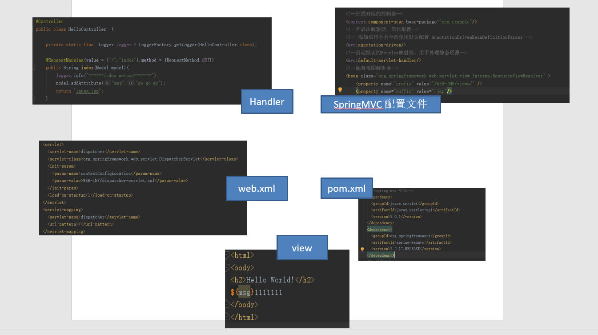
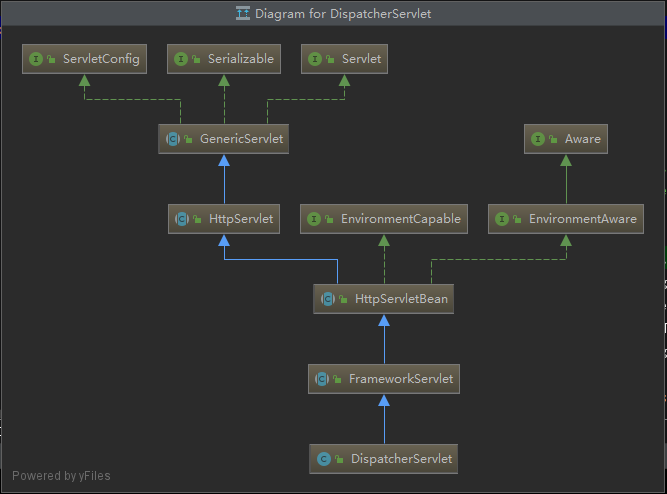
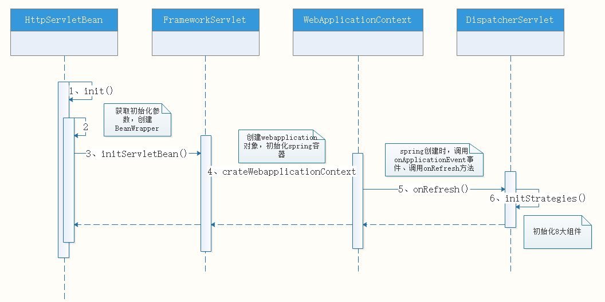

# Spring MVC分享(1)

### 模块一、Spring MVC 配置文件

### 模块二、Spring MVC 自身的创建过程

---

提起Spring MVC 脑子里出现的就是这张图，这是Spring MVC的核心架构图，这次分享，我们将从创建项目到项目运行来详细解释我们开发时配置的信息是怎么运行成程序并可以成功请求。

首先我们要创建一个简单的Spring MVC的demo，

步骤：

1、在pom.xml文件里添加依赖

2、在 web.xml 中配置 DispatcherServlet

3、加入 Spring MVC 的配置文件

4、编写Controller请求的处理器

5、写页面

我们首先从配置文件讲起

# 1、配置文件

一个简单的Sping MVC项目中用到的配置文件主要有**pom.xml、web.xml、*-servlet.xml** 这三类

- pom.xml
-- 
> 在pom文件中引入servlet和spring mvc的依赖
>
    <!--spring mvc 引入-->
    <dependency>
      <groupId>javax.servlet</groupId>
      <artifactId>javax.servlet-api</artifactId>
      <version>3.0.1</version>
    </dependency>
    <dependency>
      <groupId>org.springframework</groupId>
      <artifactId>spring-webmvc</artifactId>
      <version>3.2.17.RELEASE</version>
    </dependency>

- web.xml
-- 
> web.xml文件是用来初始化配置信息：比如Welcome页面、servlet、servlet-mapping、filter、listener、启动加载级别等。
> 在配置文件中我们可以指定SpringMVC的入口程序DispatcherServlet，同时指定了一个或多个核心配置文件（[servlet-name]-servlet.xml）。Spring官方文档上推荐的默认的文件名是[servlet-name]-servlet.xml文件。
> 
> **SpringMVC配置文件的解析就是在DispatcherServlet初始化时进行的** DispatcherServlet是继承自FrameworkServlet，而FrameworkServlet又继承自HttpServletBean，init()方法，就是在HttpServletBean.java中执行的。这个我们在后面会提到。
> 
	<!-- 自动启动，mapping 所有的请求 spring mvc 的入口-->
	<!-- servlet 配置区域 -->
	<servlet>
		<servlet-name>dispatcher</servlet-name>
		<servlet-class>org.springframework.web.servlet.DispatcherServlet</servlet-class>
	<init-param>
		<param-name>contextConfigLocation</param-name>
		<param-value>WEB-INF/dispatcher-servlet.xml</param-value>
	</init-param>
	<load-on-startup>1</load-on-startup>
	</servlet>
		<servlet-mapping>
		<servlet-name>dispatcher</servlet-name>
		<url-pattern>/</url-pattern>
	</servlet-mapping>
除了配置sevlet外，我们还可以配置过滤，监听等
>
	<!--设置过滤器：比如设置一个编码过滤器，过滤所有资源-->
	<filter>
		<filter-name>encodingFilter</filter-name>
		<filter-class>com.boloni.framework.web.filter.SetCharacterEncodingFilter</filter-class>
		<init-param>
			<param-name>encoding</param-name>
			<param-value>UTF-8</param-value>
		</init-param>
	</filter>
	<filter-mapping>
		<filter-name>encodingFilter</filter-name>
		<url-pattern>/*</url-pattern>
	</filter-mapping>
	<!--设置监听器-->
	<listener>
	    <listener-class>org.apache.tiles.extras.complete.CompleteAutoloadTilesListener</listener-class>
	</listener>

- *-servlet.xml
-- 
> 在DispatcherServlet初始化时，会根据配置的参数获取相应的配置文件并解析。DispatcherServlet通过configureAndRefreshWebApplicationContext配置文件解析，这个在后面会讲到，这儿先一笔带过。
> 
> 在这个配置文件中可以配置相应的映射器和解析器
>
    <!--扫描对应的控制器-->
    <context:component-scan base-package="com.example"/>
    <!--开启注解驱动，简化配置-->
    <mvc:annotation-driven/>
    <!--启动默认的Servlet映射器，用于处理静态资源-->
    <mvc:default-servlet-handler/>
    <!--配置视图解析器-->
    <bean class="org.springframework.web.servlet.view.InternalResourceViewResolver" >
        <property name="prefix" value="/WEB-INF/views/" />
        <property name="suffix" value=".jsp"/>
    </bean>
> mvc:annotation-driven
> 
> <mvc:annotation-driven /> 会自动注 册RequestMappingHandlerMapping
、RequestMappingHandlerAdapter 与
ExceptionHandlerExceptionResolver	三个bean。支持表单转换参数、数据格式化等

- **配置文件详解**
-- 
>在每个配置文件头部中我们可以看到这样一坨的url,这一坨url是命名空间声明和协议位置属性指定
>
		xmlns="http://www.springframework.org/schema/beans"
		xmlns:xsi="http://www.w3.org/2001/XMLSchema-instance" 
		xmlns:p="http://www.springframework.org/schema/p"
		xmlns:context="http://www.springframework.org/schema/context"
		xmlns:aop="http://www.springframework.org/schema/aop"
		xmlns:tx="http://www.springframework.org/schema/tx"
		xsi:schemaLocation="http://www.springframework.org/schema/beans
		http://www.springframework.org/schema/beans/spring-beans-4.3.xsd
		http://www.springframework.org/schema/context
		http://www.springframework.org/schema/context/spring-context-4.3.xsd
		http://www.springframework.org/schema/aop
		http://www.springframework.org/schema/aop/spring-aop-4.3.xsd
		http://www.springframework.org/schema/tx
		http://www.springframework.org/schema/tx/spring-tx-4.3.xsd"

>官方说明：
>
>XML Schema语言也就是XSD。XML Schema描述了XML文档的结构。 
可以用一个指定的XML Schema来验证某个XML文档，以检查该XML文档是否符合其要求。文档设计者可以通过XML Schema指定一个XML文档所允许的结构和内容，并可据此检查一个XML文档是否是有效的。XML Schema本身是一个XML文档，它符合XML语法结构。可以用通用的XML解析器解析它。
一个XML Schema会定义：文档中出现的元素、文档中出现的属性、子元素、子元素的数量、子元素的顺序、元素是否为空、元素和属性的数据类型、元素或属性的默认 和固定值。
那解析配置文件，系统是怎么根据标签元素查询到命名空间的？sax或者dom解析器首先将xml文件转换成内存中的文档document，这个时候会把标签对应的命名空间解析出来并保存到Node中，后面根据node.getNamespaceURI()就可以获取标签对应的命名空间。
> xmlns 是xml 命名空间(xml name space)， 用来标识唯一的文件，防止重复或者指向不清晰，命名空间的声明语法是，xmlns : 别名 = namespace的统一资源标识符(URI)：
>
	xmlns:namespace-aliases="namespaceURI"
>
>例如上述命名空间声明中:
>
		<!-- 没有别名，是默认的命名空间-->
		xmlns="http://www.springframework.org/schema/beans"
		xmlns:xsi="http://www.w3.org/2001/XMLSchema-instance" 
		<!-- 别名是context-->
		xmlns:context="http://www.springframework.org/schema/context"
>所以别名只作为该命名空间的标识，是可以自定义， 例如：
>
	xmlns:ttt="http://www.springframework.org/schema/context"

>相应的当使用该命名空间时也要进行对应的更改：
>
	<!--包扫描-->
	<ttt:component-scan base-package="com.calm.login.dao"/>

> xmlns:xsi
>大家注意到下面的两条有点不同
>
	xmlns:xsi="http://www.w3.org/2001/XMLSchema-instance" 
>
	xsi:schemaLocation="http://www.springframework.org/schema/beans
	http://www.springframework.org/schema/beans/spring-beans-4.3.xsd
	http://www.springframework.org/schema/context
	http://www.springframework.org/schema/context/spring-context-4.3.xsd"
>
xsi也是一个别名，只是这个别名约定俗成，语意性强，大家容易看懂。是（xml schema instance）的缩写，指定schema资源文件里定义的元素所准守的标准和规范。所以xsi需要明确通过属性schemaLocation来指定这些xml协议定义的具体文件。
>
	xsi:schemaLocation="http://www.springframework.org/schema/beans
	http://www.springframework.org/schema/beans/spring-beans-4.3.xsd"

>**xsi:schemaLocation**指定协议具体的路径，因为一个命名空间下还会存在多个版本的xsd(Xml Schema Definition 协议定义)文件

上述是Demo的配置文件，至此完成简单的配置工作，在项目里增加Controller，page即可通过URL访问成功，那么项目是如何编译运行让url可以解析到类的，之前那说的Dispathcher如何初始化，怎样解析文件？下面我们继续

# 2、Spring MVC自身的创建过程

刚刚说到DispatcherServlet是SpringMVC的入口程序，先看一下这个类的的关系图,Servlet的继承结构中有一共有5个类，GenericServlet和HttpServlet在java中，剩下的三个类HttpServletBean、FrameworkServlet和DispatcherServlet是Spring MVC中的，这三个类直接实现三个接口：EnvironmentCapable、EnvironmentAware和ApplicationContextAware。

- DispatcherServlet
-- 
>初始化各个功能的实现类。比如异常处理、视图处理、请求映射处理等。
>DispatcherServlet是继承自FrameworkServlet，而FrameworkServlet又继承自HttpServletBean，init()方法，就是在HttpServletBean.java中执行的。

>DispatcherServlet覆写了FrameworkServlet中的onRefresh方法。
>
	public class DispatcherServlet extends FrameworkServlet {
	...
		//初始化了9大组件
	    protected void onRefresh(ApplicationContext context) {
	        this.initStrategies(context);
	    }
>	
	    protected void initStrategies(ApplicationContext context) {
	        initMultipartResolver(context);//用于处理上传请求。
	        initLocaleResolver(context);// 解析视图
	        initThemeResolver(context);//用于解析主题。
	        initHandlerMappings(context);//查找Handler的
	        initHandlerAdapters(context);//请求的时候是如何找到正确的Controller
	        initHandlerExceptionResolvers(context);//异常处理机制
	        initRequestToViewNameTranslator(context);//从request中获取ViewName
	        initViewResolvers(context);//视图机制
	        initFlashMapManager(context);//用来管理FlashMap的，FlashMap主要用在redirect中传递参数。
	    }
	...
	}
- HttpServletBean
-- 
>主要做一些初始化的工作，将web.xml中配置的参数设置到Servlet中。比如servlet标签的子标签init-param标签中配置的参数。
>
>HttpSerlvetBean继承自HttpServlet，它覆写了init方法，对初始化过程做了一些处理。 
>
	    public abstract class HttpServletBean extends HttpServlet implements EnvironmentCapable, EnvironmentAware {
    	...
	    	@Override
	    	public final void init() throws ServletException {
		    	if (logger.isDebugEnabled()) {
		    		logger.debug("Initializing servlet '" + getServletName() + "'");
		    	}
		    	// Set bean properties from init parameters.
		    	try {
					//ServletConfigPropertyValues是HttpServletBean内部静态类，使用ServlertConfig对象找出web.xml配置文件中的配置参数并设置到ServletConfigPropertyValues内，封装到pvs变量中
			    	PropertyValues pvs = new ServletConfigPropertyValues(getServletConfig(), this.requiredProperties);
					//使用PropertyAccessorFactory封装成BeanWrapper，那么BeanWrapper是什么呢？
					//使用BeanWrapper构造DispatcherServlet
			    	BeanWrapper bw = PropertyAccessorFactory.forBeanPropertyAccess(this);
			    	ResourceLoader resourceLoader = new ServletContextResourceLoader(getServletContext());
					//Resource 使用属性编辑器
			    	bw.registerCustomEditor(Resource.class, new ResourceEditor(resourceLoader, getEnvironment()));
			    	//模版方法，可以在子类调用，做一些初始化工作。bw代表DispatcherServlet
			    	initBeanWrapper(bw);
			    	//将配置对初始化值（如contextConfigLocation）设置DispatcherServlet
			    	bw.setPropertyValues(pvs, true);
		    	}
		    	catch (BeansException ex) {
			    	if (logger.isErrorEnabled()) {
			    		logger.error("Failed to set bean properties on servlet '" + getServletName() + "'", ex);
			    	}
			    	throw ex;
		    	}
>		    	
		    	// Let subclasses do whatever initialization they like.
		    	//模版方法，子类初始化对入口方法
		    	initServletBean();
>		    	
		    	if (logger.isDebugEnabled()) {
		    		logger.debug("Servlet '" + getServletName() + "' configured successfully");
		    	}
	    	}
    	...
    	}
> web.xml
>
	<servlet>
		<servlet-name>dispatcher</servlet-name>
		<servlet-class>org.springframework.web.servlet.DispatcherServlet</servlet-class>
	<init-param>
		<param-name>contextConfigLocation</param-name>
		<param-value>WEB-INF/dispatcher-servlet.xml</param-value>
	</init-param>
	<load-on-startup>1</load-on-startup>
	</servlet>
		<servlet-mapping>
		<servlet-name>dispatcher</servlet-name>
		<url-pattern>/</url-pattern>
	</servlet-mapping>
> 传递了contextConfigLocation参数，之后构造BeanWrapper，这里使用BeanWrapper，有2个理由：
> 
1. contextConfigLocation属性在FrameworkServlet中定义，HttpServletBean中未定义       
2. 利用Spring的注入特性，只需要调用setPropertyValues方法就可将contextConfigLocation属性设置到对应实例中，也就是以依赖注入的方式初始化属性。
>
>然后设置DispatcherServlet中的contextConfigLocation属性(FrameworkServlet中定义)为web.xml中读取的contextConfigLocation参数，该参数用于构造SpringMVC容器上下文。

- FrameworkServlet
--

>将Servlet与Spring容器上下文关联。其实也就是初始化FrameworkServlet的属性webApplicationContext，这个属性代表SpringMVC上下文，它有个父类上下文，既web.xml中配置的ContextLoaderListener监听器初始化的容器上下文。

>可以看到这里的核心代码只有两句：一句用于初始化WebApplicationContext，另一句用于初始化FrameworkServlet，而且initFrameworkServlet方法是模版方法，子类可以覆盖然后在里面做一些初始化的工作，但子类并没有使用它。
>
		public abstract class FrameworkServlet extends HttpServletBean implements ApplicationContextAware {
		    ...
		    @Override
		    protected final void initServletBean() throws ServletException {
		        getServletContext().log("Initializing Spring FrameworkServlet '" + getServletName() + "'");
		        if (this.logger.isInfoEnabled()) {
		            this.logger.info("FrameworkServlet '" + getServletName() + "': initialization started");
		        }
		        long startTime = System.currentTimeMillis();
>		
		        try {
					//初始化WebApplicationContext属性
					//WebApplicationContext是继承自ApplicationContext接口的接口，该属性也就是Spring容器的上下文。
					//FrameworkServlet的作用就是就将Servlet和Spring容器关联
		            this.webApplicationContext = initWebApplicationContext();
					//initFrameworkServlet方法是模版方法，子类可以覆盖然后在里面做一些初始化的工作，但DispatcherServlet子类并没有使用它。
		            initFrameworkServlet();
		        }
		        catch (ServletException ex) {
		            this.logger.error("Context initialization failed", ex);
		            throw ex;
		        }
		        catch (RuntimeException ex) {
		            this.logger.error("Context initialization failed", ex);
		            throw ex;
		        }
>		
		        if (this.logger.isInfoEnabled()) {
		            long elapsedTime = System.currentTimeMillis() - startTime;
		            this.logger.info("FrameworkServlet '" + getServletName() + "': initialization completed in " +
		                    elapsedTime + " ms");
		        }
		    }
		    ...
		}
可见FrameworkServlet在构建的过程中到主要作用就是初始化了WebApplication。下面来看一下initWebApplicationContext方法。
initWebApplicationContext方法的具体实现逻辑：
>
		protected WebApplicationContext initWebApplicationContext() {
		    //获取rootContext
		    WebApplicationContext rootContext =
		            WebApplicationContextUtils.getWebApplicationContext(getServletContext());
		    WebApplicationContext wac = null;
		    //如果已经通过构造方法设置了WebApplicationContext--DispatcherServlet有个以WebApplicationContext为参数的构造函数，当时使用WebApplicationContext参数的构造函数时进入该方法
		    if (this.webApplicationContext != null) {
		        // A context instance was injected at construction time -> use it
		        wac = this.webApplicationContext;
		        if (wac instanceof ConfigurableWebApplicationContext) {
		            ConfigurableWebApplicationContext cwac = (ConfigurableWebApplicationContext) wac;
		            if (!cwac.isActive()) {
		                // The context has not yet been refreshed -> provide services such as
		                // setting the parent context, setting the application context id, etc
		                if (cwac.getParent() == null) {
		                    // The context instance was injected without an explicit parent -> set
		                    // the root application context (if any; may be null) as the parent
		                    cwac.setParent(rootContext);
		                }
		                configureAndRefreshWebApplicationContext(cwac);
		            }
		        }
		    }
		    if (wac == null) {
				//以contextAtttibue属性(FrameworkServlet的string属性类型)为key
		        //当webApplicationContext已经存在ServletContext中时，通过配置在servlet中的contextAttribute参数获取，如未配置为null
		        wac = findWebApplicationContext();
		    }
		    if (wac == null) {
		        //如果webApplicationContext还没有创建，则创建一个,根据rootContext为父创建，然后配置ServletConfig,ServletContext等实例到创建的上下文中
		        wac = createWebApplicationContext(rootContext);
		    }		
		    if (!this.refreshEventReceived) {
				//模版方法，可以在子类重写,FrameworkServlet空实现
		        //当ContextRefresh事件没有触发时调用此方法，
		        onRefresh(wac);
		    }		
		    if (this.publishContext) {
		        String attrName = getServletContextAttributeName();
				//将新创建的容器上下文设置到ServletContext中
		        getServletContext().setAttribute(attrName, wac);
		        if (this.logger.isDebugEnabled()) {
		            this.logger.debug("Published WebApplicationContext of servlet '" + getServletName() +
		                    "' as ServletContext attribute with name [" + attrName + "]");
		        }
		    }		
		    return wac;
		}

知道了这三个都是干什么的，我们再统一的看一下springMVC的初始化序列图

---

至此，项目已经成功启动。
Spring MVC中Servlet一共三个层次，分别是HttpServletBean、FrameworkServlet和DispatcherServlet。HttpServletBean直接继承自Java的HttpServlet，其作用是将Servlet中配置的参数设置到相应的属性：FrameworkServlet初始化了WebApplicationContext，DispatcherServlet初始化了自身的9个组件。

 整体结构非常简单---分三个层次做了三件事，但实际具体实现过程还是有点复杂的，可配置的地方非常多，让Spring MVC使用起来更加灵活。
